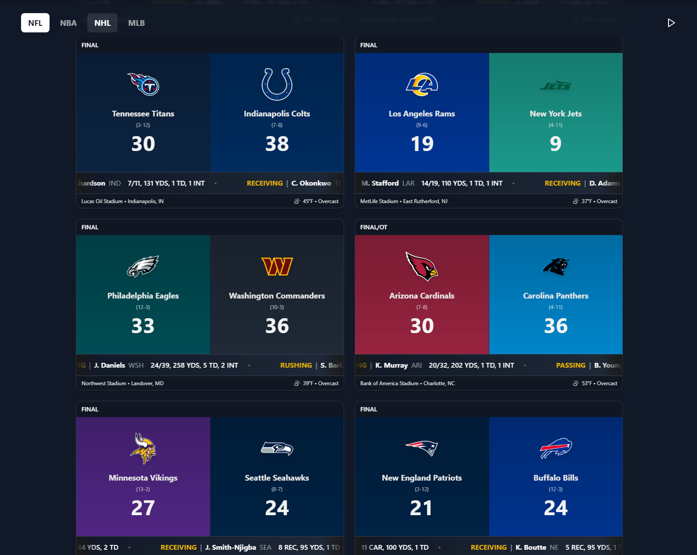

# Project Live Score

[Check it out here](https://serene-melomakarona-8847ea.netlify.app/)

A modern, real-time sports statistics and scoring platform built with React and TypeScript. This application provides live game updates, player statistics, and an interactive user interface for multiple professional sports leagues.

## Purpose

Project Live Score is designed to enhance social sports viewing experiences. Whether you're hosting a game day party, at a sports bar, or just want to keep track of multiple games, our platform provides a clean, professional scoreboard display with real-time updates. Perfect for venues, social gatherings, or any setting where you want to keep everyone informed of the action across multiple games.

## Features

### Comprehensive Sports Coverage
- **NFL**: Real-time player statistics, game leaders, and play-by-play analysis
- **NBA**: Player statistics and game highlights (In Development)
- **NHL**: Goals, assists, and game statistics (In Development)
- **MLB**: Comprehensive baseball statistics (In Development)

### Core Functionality
- Real-time score updates and game tracking
- Live player statistics with quarter/period updates
- Dynamic stat ticker with scrolling updates
- Team-specific theming and color schemes
- Responsive design for all devices

#### Sport-Specific Tickers
Specialized components for each sport's statistics:
- `NFLTicker`: Comprehensive NFL statistics
- `NBATicker`: Basketball statistics (In Development)
- `NHLTicker`: Hockey statistics (In Development)
- `MLBTicker`: Baseball statistics (In Development)

For support, feature requests, or bug reports, please open an issue in the repository.